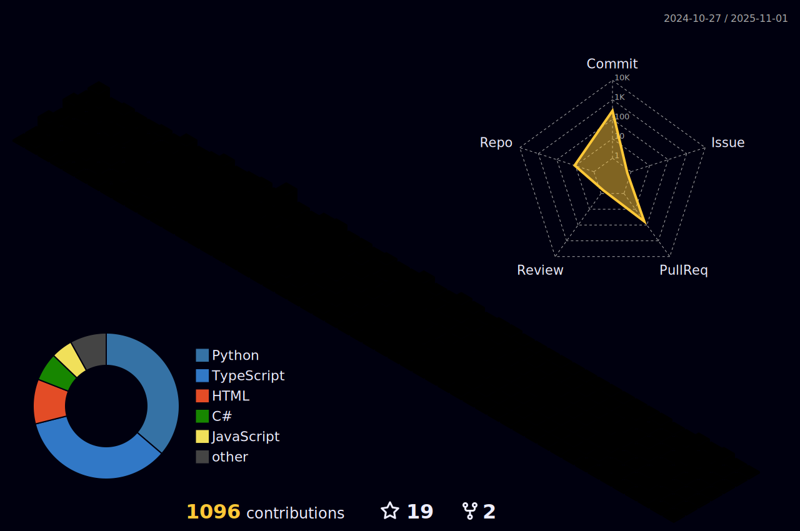

im a student ,beginner, a gamer. Loves to sleep <3 

<h3> 🧰 Curently working </h3>

[anthonyjohnhinay/sauce](https://github.com/anthonyjohnhinay/sauce) - Discord Music bot with Covid-19 tally
 
 

<h3> Languages and Tools:</h3>

 
 <!---Html--->
  
 <!---Flask--->
   
 <!---Ps--->
  
 <!---Python--->
  
 <!---Git--->
  
 <!---Deb--->
  
  <!---Bootstrap--->
  
 <!---Google--->
   

<h3> 🖥️ Stats </h3>

